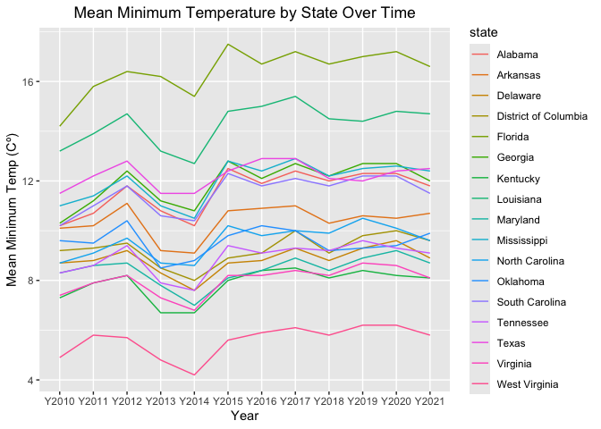
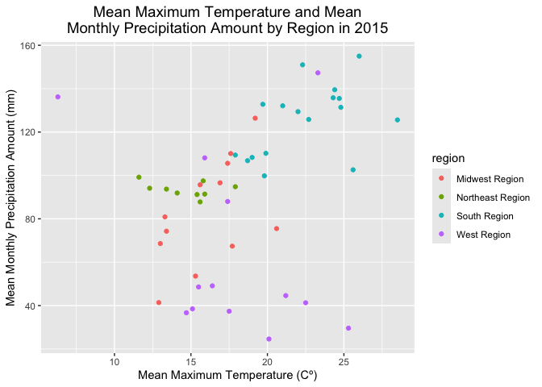

# Geog4/6300: Lab 1


## Loading data into R, data transformation, and summary statistics

**Mary Elizabeth Rudd**

**Overview and lab criteria:**

This lab is intended to assess your ability to use R to load data and to
generate basic descriptive statistics. For this lab to be marked
complete, the following criteria must be met:

4.  Identify and apply appropriate data filtering and cleaning
    strategies to prepare datasets for analysis. (Task 2)
5.  Effectively interpret the code you create, explaining in plain
    language what each step does to the data. (Task 6)
6.  Identify and use appropriate external documentation — including
    package references, help files, and peer resources — to learn and
    apply unfamiliar functions or methods. (Task 7)
7.  Filter, aggregate, and transform datasets using grouping and summary
    operations to answer specific analytical questions. (Tasks 1 & 5)
8.  Reshape data between wide and long formats to meet the requirements
    of different analytical or visualization tasks. (Task 4)
9.  Create effective data visualizations across multiple chart types
    (line, scatter, histogram, Q-Q plot), applying appropriate aesthetic
    choices such as color, grouping, and labeling. (Task 3 & 5)

**Data:**

You’ll be using monthly weather data from the Daymet climate database
(http://daymet.ornl.gov) for all counties in the United States over an
12-year period (2010-2021). These data are available on the GitHub repo
for our course. The following variables are provided:

- `cty_txt`: Code for joining to census data
- `year`: Year of observation (with an initial “Y” to make it a
  character)
- `month`: Month of observation (1 = Jan, 2 = Feb, etc.)
- `median_tmax`: Median maximum recorded temperature (Celsius)
- `median_tmin`: Median minimum recorded temperature (Celsius)
- `sum_prcp`: Total recorded precipitation for the month (mm)
- `cty_name`: Name of the county
- `state`: State of the county
- `region`: Census region (map:
  https://www2.census.gov/geo/pdfs/maps-data/maps/reference/us_regdiv.pdf)
- `division`: Census division
- `X`: Longitude of the county centroid
- `Y`: Latitude of the county centroid

These labs are meant to be done collaboratively, but your final
submission should demonstrate your own original thought (don’t just copy
your classmate’s work or turn in identical assignments). Your answers to
the lab questions should be typed in this Quarto template. You’ll then
render the document to a GitHub markdown document and upload it to your
class GitHub repo.

**Procedure:**

Load the tidyverse package and import the data:

``` r
library(tidyverse)

daymet_data <- read_csv("data/daymet_monthly_median_2010-2021.csv")
```

We can look at the first few rows of the dataset using the *head()*
function. We also use *kable* to format the output as a readable table..

``` r
kable(head(daymet_data))
```

| cty_txt | year | month | median_tmax | median_tmin | sum_prcp | cty_name | state | region | division | x | y |
|:---|:---|---:|---:|---:|---:|:---|:---|:---|:---|---:|---:|
| G02060 | Y2010 | 1 | -4.27 | -10.83 | 10.04 | Bristol Bay | Alaska | West Region | Pacific Division | -156.7011 | 58.74213 |
| G02185 | Y2010 | 1 | -20.73 | -28.20 | 0.00 | North Slope | Alaska | West Region | Pacific Division | -153.4411 | 69.30696 |
| G02180 | Y2010 | 1 | -16.50 | -23.72 | 5.75 | Nome | Alaska | West Region | Pacific Division | -163.9703 | 64.89492 |
| G02050 | Y2010 | 1 | -11.20 | -18.90 | 24.55 | Bethel | Alaska | West Region | Pacific Division | -159.7678 | 60.92187 |
| G02261 | Y2010 | 1 | -13.93 | -20.03 | 15.84 | Valdez-Cordova | Alaska | West Region | Pacific Division | -144.4573 | 61.57080 |
| G02170 | Y2010 | 1 | -5.10 | -12.42 | 35.84 | Matanuska-Susitna | Alaska | West Region | Pacific Division | -149.5702 | 62.31653 |

There are a lot of observations here, 452,448 to be exact. To get a
better grasp on the data, we can use `group_by()` and `summarise()` from
the tidyverse package. This will allow us to identify the mean value for
each year by county across the study period.

## Task 1

*Use `group_by()` and `summarise()` to calculate the mean minimum
temperature for each year by county across all months, also including
State and Region as grouping variables. Your resulting dataset should
show the value of tmin for each county in each year. Use the `kable()`
and `head()` functions as shown above to call the resulting table.*

``` r
daymet_tmin <- daymet_data %>%
  group_by(state, region, cty_name, year) %>%
  summarise(mean_tmin = mean(median_tmin))
```

    `summarise()` has regrouped the output.
    ℹ Summaries were computed grouped by state, region, cty_name, and year.
    ℹ Output is grouped by state, region, and cty_name.
    ℹ Use `summarise(.groups = "drop_last")` to silence this message.
    ℹ Use `summarise(.by = c(state, region, cty_name, year))` for per-operation
      grouping (`?dplyr::dplyr_by`) instead.

``` r
kable(head(daymet_tmin))
```

| state   | region       | cty_name | year  | mean_tmin |
|:--------|:-------------|:---------|:------|----------:|
| Alabama | South Region | Autauga  | Y2010 |  10.66375 |
| Alabama | South Region | Autauga  | Y2011 |  10.81333 |
| Alabama | South Region | Autauga  | Y2012 |  12.19917 |
| Alabama | South Region | Autauga  | Y2013 |  11.21500 |
| Alabama | South Region | Autauga  | Y2014 |  10.76167 |
| Alabama | South Region | Autauga  | Y2015 |  13.09750 |

## Task 2

*Let’s shift to the state level, focusing on those in the South Region.
Filter the original data frame (`daymet_data`) to just include counties
in this region. Then calculate the mean minimum temperature by year for
each state. For an optional extra challenge, use the `round()` function
to include only 1 decimal point. Use `kable()` and `head()` to call the
first few lines of the resulting table.*

``` r
daymet_south <- daymet_data %>%
  filter(region == "South Region") %>%
  group_by(state,year) %>%
  summarise(mean_tmin = round(mean(median_tmin), 1))
```

    `summarise()` has regrouped the output.
    ℹ Summaries were computed grouped by state and year.
    ℹ Output is grouped by state.
    ℹ Use `summarise(.groups = "drop_last")` to silence this message.
    ℹ Use `summarise(.by = c(state, year))` for per-operation grouping
      (`?dplyr::dplyr_by`) instead.

``` r
kable(head(daymet_south))
```

| state   | year  | mean_tmin |
|:--------|:------|----------:|
| Alabama | Y2010 |      10.2 |
| Alabama | Y2011 |      10.7 |
| Alabama | Y2012 |      11.8 |
| Alabama | Y2013 |      10.8 |
| Alabama | Y2014 |      10.2 |
| Alabama | Y2015 |      12.5 |

## Task 3

*To visualize the trends, we could use ggplot to visualize change in
mean temperature over time. Create a line plot (`geom_line`) showing the
state means you calculated in task 2. Use the `color` parameter to show
separate colors for each state. You may also need to define the state as
a group in the aesthetic parameter.*

``` r
  ggplot(daymet_south, 
         aes(x=year,
             y=mean_tmin,
             color=state,
             group=state))+
  geom_line() +
  labs(title="Mean Minimum Temperature by State Over Time",
       x="Year",
       y="Mean Minimum Temp (Cº)") +
  theme(plot.title = element_text(hjust = 0.5))
```



## Task 4

*If you wanted to look at these data as a table, you’d need to have it
in wide format. Use the `pivot_wider()` function to create a wide-format
version of the data frame you created in task 2. In this case, the rows
should be states, the columns should be the years, and the data in those
columns should be mean minimum temperatures. Then call the whole table
using `kable()`.*

``` r
daymet_south_wide<-daymet_south %>%
  pivot_wider(id_cols="state",
               names_from="year",
               values_from="mean_tmin")

kable(daymet_south_wide)
```

| state | Y2010 | Y2011 | Y2012 | Y2013 | Y2014 | Y2015 | Y2016 | Y2017 | Y2018 | Y2019 | Y2020 | Y2021 |
|:---|---:|---:|---:|---:|---:|---:|---:|---:|---:|---:|---:|---:|
| Alabama | 10.2 | 10.7 | 11.8 | 10.8 | 10.2 | 12.5 | 11.9 | 12.4 | 12.0 | 12.3 | 12.3 | 11.8 |
| Arkansas | 10.1 | 10.2 | 11.1 | 9.2 | 9.1 | 10.8 | 10.9 | 11.0 | 10.3 | 10.6 | 10.5 | 10.7 |
| Delaware | 8.7 | 8.8 | 9.2 | 8.3 | 7.6 | 8.7 | 8.8 | 9.3 | 8.8 | 9.3 | 9.6 | 8.9 |
| District of Columbia | 9.2 | 9.3 | 9.5 | 8.5 | 8.0 | 8.9 | 9.1 | 10.0 | 9.1 | 9.8 | 10.0 | 9.6 |
| Florida | 14.2 | 15.8 | 16.4 | 16.2 | 15.4 | 17.5 | 16.7 | 17.2 | 16.7 | 17.0 | 17.2 | 16.6 |
| Georgia | 10.3 | 11.2 | 12.4 | 11.2 | 10.8 | 12.8 | 12.1 | 12.7 | 12.2 | 12.7 | 12.7 | 12.0 |
| Kentucky | 7.3 | 7.9 | 8.2 | 6.7 | 6.7 | 8.0 | 8.4 | 8.5 | 8.1 | 8.4 | 8.2 | 8.1 |
| Louisiana | 13.2 | 13.9 | 14.7 | 13.2 | 12.7 | 14.8 | 15.0 | 15.4 | 14.5 | 14.4 | 14.8 | 14.7 |
| Maryland | 8.3 | 8.6 | 8.7 | 7.8 | 7.0 | 8.1 | 8.4 | 8.9 | 8.4 | 8.9 | 9.2 | 8.7 |
| Mississippi | 11.0 | 11.4 | 12.2 | 11.0 | 10.5 | 12.8 | 12.4 | 12.9 | 12.2 | 12.5 | 12.6 | 12.4 |
| North Carolina | 8.7 | 9.1 | 9.7 | 8.7 | 8.6 | 10.2 | 9.8 | 10.0 | 9.9 | 10.5 | 10.1 | 9.6 |
| Oklahoma | 9.6 | 9.5 | 10.4 | 8.5 | 8.8 | 9.8 | 10.2 | 10.0 | 9.2 | 9.3 | 9.4 | 9.9 |
| South Carolina | 10.2 | 11.0 | 11.8 | 10.6 | 10.4 | 12.3 | 11.8 | 12.1 | 11.8 | 12.2 | 12.2 | 11.5 |
| Tennessee | 8.3 | 8.6 | 9.4 | 7.9 | 7.6 | 9.4 | 9.1 | 9.3 | 9.2 | 9.6 | 9.3 | 9.1 |
| Texas | 11.5 | 12.2 | 12.8 | 11.5 | 11.5 | 12.4 | 12.9 | 12.9 | 12.1 | 12.0 | 12.4 | 12.5 |
| Virginia | 7.4 | 7.9 | 8.2 | 7.3 | 6.8 | 8.2 | 8.2 | 8.4 | 8.2 | 8.7 | 8.6 | 8.1 |
| West Virginia | 4.9 | 5.8 | 5.7 | 4.8 | 4.2 | 5.6 | 5.9 | 6.1 | 5.8 | 6.2 | 6.2 | 5.8 |

## Task 5

*Let’s assess the relationship of heat and precipitation by region.
Returning to the original dataset, create a data frame that shows the
mean maximum temperature and mean precipitation for all states in 2015,
also including region as a subgroup in your `group_by`. Then use ggplot
to create a scatterplot (`geom_point`) for these two variables, coloring
the points using the region variable.*

``` r
daymet_regions <- daymet_data %>%
  filter(year=="Y2015")%>%
  group_by(state,year,region) %>%
  summarise(mean_tmax = round(mean(median_tmax), 1),
           mean_prcp= round(mean(sum_prcp), 1))
```

    `summarise()` has regrouped the output.
    ℹ Summaries were computed grouped by state, year, and region.
    ℹ Output is grouped by state and year.
    ℹ Use `summarise(.groups = "drop_last")` to silence this message.
    ℹ Use `summarise(.by = c(state, year, region))` for per-operation grouping
      (`?dplyr::dplyr_by`) instead.

``` r
ggplot(daymet_regions, 
         aes(x=mean_tmax,
             y=mean_prcp,
             color=region))+
  geom_point() +
  labs(title="Mean Maximum Temperature and Mean\nMonthly Precipitation Amount by Region in 2015",
       x="Mean Maximum Temperature (Cº)",
       y="Mean Monthly Precipitation Amount (mm)") + 
  theme(plot.title = element_text(hjust = 0.5, size = 14))
```



## Task 6

*In the space below, explain what each function in your code for task 5
does to the dataset in plain English.*

1.  daymet_regions \<- daymet_data %\>% - this takes all the functions
    done below and applies them to a new daymet_regions dataframe
2.  filter() - filters out all other years except Y2015 from the data
3.  group_by() - splits the data into groups by state/region/year
4.  summarise() turns each of the groups into one row and calculates and
    mean round inside of those rows in the tmax and pcrp columns
5.  aes () links columns to visual properties like axes, colors, etc…
6.  geom_point() draws the dots/places the data on the plot
7.  labs() allows you to change labels, axis titles, legends
8.  theme() allows you to change appearance of plot elements

First section:My first section of code filters the daymet_data dataframe
to isolate datapoints from the year 2015 and creates a new dataframe
called daymet_regions. I then grouped this filtered data by state, year,
and region to make sure the data is grouped by those variables, and then
used a function (summarise) that takes the mean of the median_tmax and
sum_prcp fields and rounds those values to 1 digit right of the decimal
point.

Second section: In this section, I created a scatter plot that displayed
each state’s mean maximum temperature (x-axis) and their mean
precipitation amount (y-axis) for 2015. I added color so that the dots
on the scatterplot are colored corresponding to their regions, i.e. the
state names aren’t visible anywhere. This creates a scatterplot that
easily shows the patterns in average precipitation and temperatures in
each region. I added a plot title with a manual line break and titles
for my x and y axes, as well as centered and set a size for my plot
title.

## Task 7

*The `dplyr` package also includes `across` function. Use `?across` on
the R command line to open the documentation for this function. In the
space below, explain what it does in your own words. Then interpret the
way the across function is used below, going line by line within the
function.*

``` r
state_2015 <- daymet_data %>%
  filter(year == "Y2015") %>%
  group_by(region, state) %>%
  summarise(
    across(
      c(median_tmax, sum_prcp),
      mean,
      na.rm = TRUE,
      .names = "mean_{.col}"
    )
  )
```

    Warning: There was 1 warning in `summarise()`.
    ℹ In argument: `across(c(median_tmax, sum_prcp), mean, na.rm = TRUE, .names =
      "mean_{.col}")`.
    ℹ In group 1: `region = "Midwest Region"`, `state = "Illinois"`.
    Caused by warning:
    ! The `...` argument of `across()` is deprecated as of dplyr 1.1.0.
    Supply arguments directly to `.fns` through an anonymous function instead.

      # Previously
      across(a:b, mean, na.rm = TRUE)

      # Now
      across(a:b, \(x) mean(x, na.rm = TRUE))

    `summarise()` has regrouped the output.
    ℹ Summaries were computed grouped by region and state.
    ℹ Output is grouped by region.
    ℹ Use `summarise(.groups = "drop_last")` to silence this message.
    ℹ Use `summarise(.by = c(region, state))` for per-operation grouping
      (`?dplyr::dplyr_by`) instead.

The ‘across’ function allows you to apply one transformation to multiple
columns at the same time. In the function above: Line 180 calls the
function within the “summarise” function, meaning we are wanting to
summarize multiple columns at the same time/not having to call a
function for each singular column we want to work with Line 181 selects
the columns median_tmax and sum_prcp Line 182 calculates the mean of
median_tmax and sum_prcp at the same time and within one singular
function Line 183 excludes missing (NA) values Line 184 is setting a
naming convention for the columns that summarise(across)) is being
applied to. It inserts “mean\_” in front of every column name, creating
mean_median_tmax and mean_sum_prcp

## Challenge Question

In class, we covered ways of working with the Daymet API. Create a
script below that uses the **daymetr** package to download data from
Daymet for a place (or places) of your choosing. Then visualize the
temporal pattern for a variable of your choosing in this place, similar
to what you did in question 4. Use a dplyr function (`mutate()`,
`summarise()`, `filter()`, etc.) to do any needed data wrangling and
create a visual using ggplot.

In addition to this code, write a short summary of a pattern that’s
evident in the data you visualized.

*Explanation goes here.*

## Final Submission Stuff

### Disclosure of Assistance

Besides class materials, what other sources of assistance did you use
while completing this lab? These can include input from classmates,
relevant material identified through web searches (e.g., Stack
Overflow), or assistance from ChatGPT or other AI tools. How did these
sources support your own learning in completing this lab?

I used Claude for question 2 because I couldn’t figure out where to put
the round function, and that’s it!

### Lab Reflection

How do you feel about the work you did on this lab? Was it easy,
moderate, or hard? What are the biggest things you learned by completing
it?

This lab was honestly a little bit easier than the previous lab, simply
because I am much more familiar with RStudio now after having more
practice with it. On a scale of 1-10 this was probably a 3.
